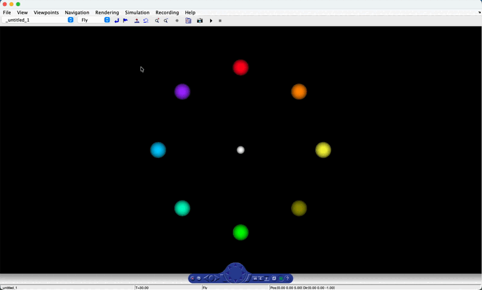
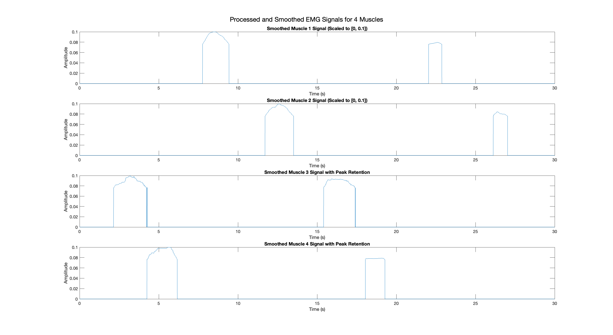
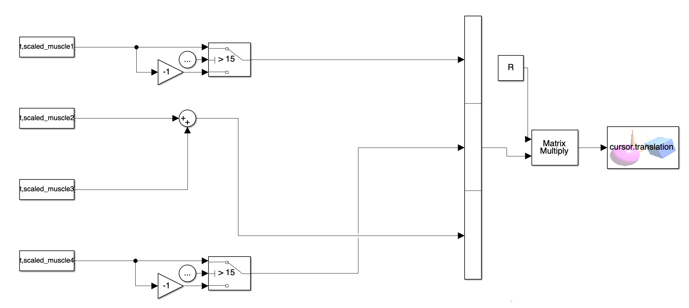
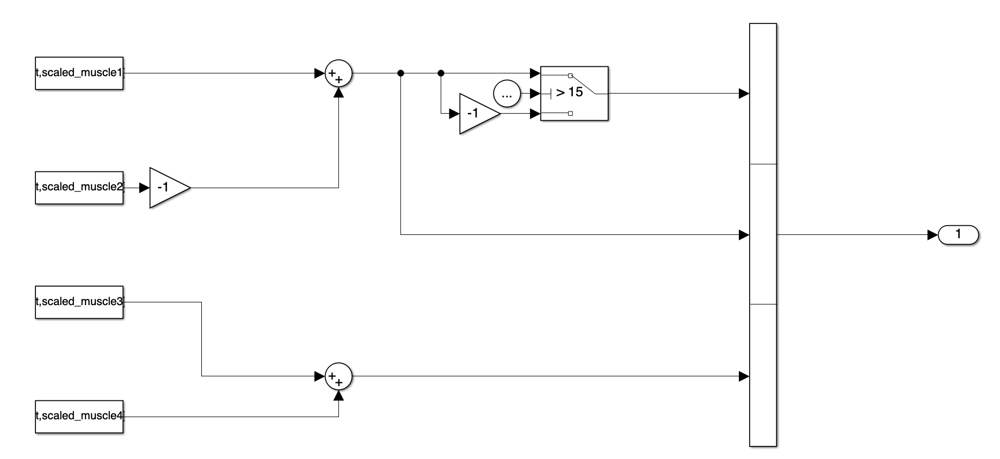
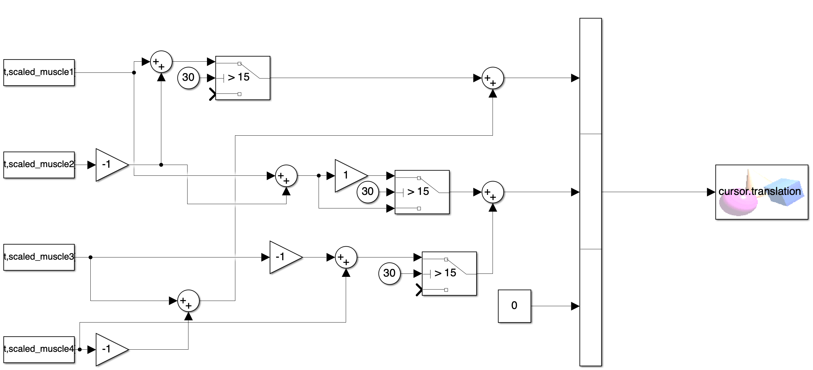
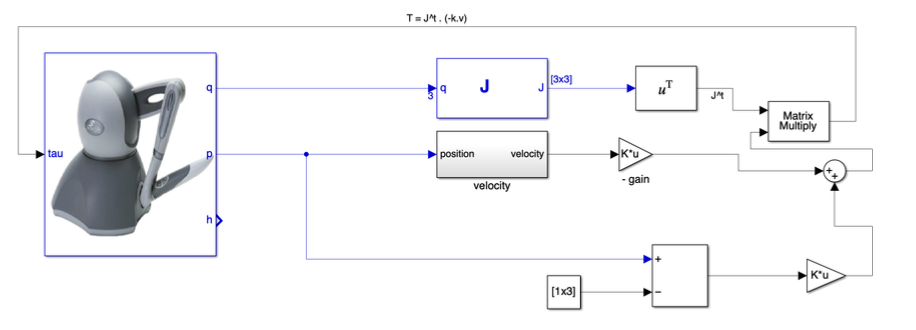
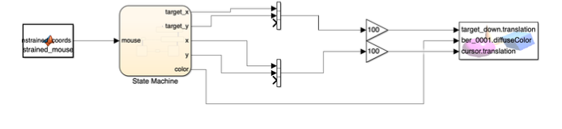
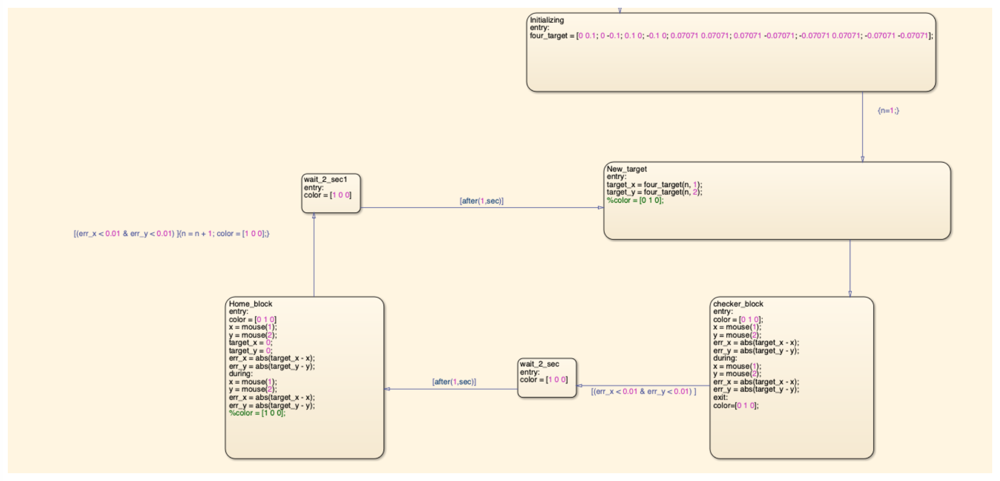

# BioMedical Robotics Projects

## Overview
This repository contains implementations and projects completed as part of the BioMedical Robotics course. The projects focus on EMG signal processing and Phantom Robot control, for practical applications in medical robotics.

## Project Demonstrations

### EMG Signal Processing Results

#### Project Demo

*Demonstration of EMG signal processing and system response*

#### Signal Processing Pipeline

*Visualization of the EMG signal processing pipeline showing filtered and processed EMG signals*

#### Simulink Implementation
1. 
   *Simulink setup for EMG signal Task_1*

2. 
   *Simulink setup for EMG signal Task_2*

3. 
   *Simulink setup for EMG signal Task_3*

### Phantom Robot Control Implementation

#### System Architecture

*Core system architecture for Phantom robot control*

#### Virtual Reality Integration

*Virtual Reality environment with the Phantom robot*

#### Control Flow

*State flow diagram showing control logic implementation*

## Project Structure

### 1. Tendon-Driven Exoskeleton Design
Our innovative approach to rehabilitation robotics focuses on a tendon-driven exoskeleton design for patient rehabilitation. This project combines mechanical efficiency with bio-inspired control mechanisms.

#### Key Features:
- **Bio-Inspired Design**: Mimics natural muscle-tendon dynamics
- **Adaptive Control**: EMG-based control system for patient-specific adaptation
- **Safety-First Approach**: Compliant actuation for safe human-robot interaction
- **Rehabilitation Focus**: Targeted therapy for upper limb rehabilitation

#### Technical Highlights:
- Compliant tendon-driven mechanism
- Integrated EMG sensing for user intent detection
- Real-time adaptation to patient effort
- Modular design for different therapy needs

### 2. EMG Signal Processing

#### Exercise 1: Basic EMG Analysis
- Implementation of fundamental EMG signal processing
- Signal acquisition and preprocessing
- Data visualization and analysis techniques

#### Exercise 2: Advanced EMG Applications
- EMG signal processing
- Integration with simulation environments
- Multiple simulation scenarios (Simulation1, Simulation2, Simulation3)
- Virtual Reality using VRML (8_palline_color.wrl)

### 2. Real Phantom Robot Control

#### Features:
- Force feedback implementation
- Real-time control algorithms
- Jacobian-based control methods
- Teleoperation capabilities

#### Key Components:
- Force Fields simulation
- Reaching task implementation
- 3-DOF control system
- Hardware integration with PHANToM device

## Technologies Used
- MATLAB/Simulink
- Virtual Reality Modeling Language (VRML)
- PHANToM Haptic Device SDK
- 3D visualization tools

## Setup and Requirements
- MATLAB with Simulink
- PHANToM device drivers and SDK
- Virtual Reality Toolbox
- Signal Processing Toolbox

---
